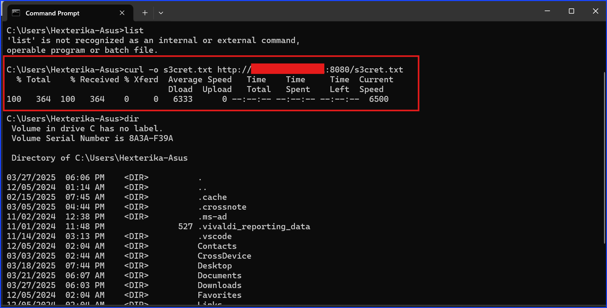

# HTTP File Transfer: Modern Security Implications

Introduction

While working on the GoldenEye room on TryHackMe, I needed to transfer a file from my Kali VM to my host machine. Out of habit, I set up a simple Python HTTP server to serve the file. However, I quickly ran into an issue. Google Chrome outright blocked the download due to security policies.

The command I used on my Kali VM was `python3 -m http.server`. This means `python3` setup a simple HTTP server to deliver the file.

As you can see from the screenshot below, the Google Chrome on my host machine flagged the file as "Not secure" when I attempted to download a legitimate text file from my Kali VM.

Instead of downloading the file, Google Chrome - a modern web browser, displayed the text content inside for me to see so I can either copy it to paste in a different text file or read and ignore it.

As you can see in the below screenshot, kali showed a 404 result to indicate an unsuccess order.

This -- got me curious: Do all modern systems enforce this restriction, or does it only apply to browsers? I decided to test different methods and compare results.

## Experiment: Testing Different Transfer Methods

### Setup

1. Kali VM running `python3 -m http.server <port>`
2. Verify that both the Kali VM and the host machine can ping each other before starting the file delivering experiment. My Kali VM was set as NAT on VMWare Workstation Pro 17.

### Experiment

1. Using `wget` on PowerShell to download the file from my Kali VM.

As you can see in the screenshot below, the file was successfully downloaded even though it was downloaded from HTTP when using a commandline from PowerShell.

As you can see, the downloaded result was 200 which indicated that the download was a success.

I tested file downloads from an HTTP Python server using:

Google Chrome → Blocked.

Command Prompt (cmd) with wget → Allowed.

PowerShell with Invoke-WebRequest → Allowed.

Ubuntu WSL Terminal with wget → Allowed.

Despite Chrome enforcing strict security policies, CLI tools had no issue retrieving the file. This means that even though browsers are getting better at preventing unsafe downloads, alternative delivery methods still work.

Security Implications

For Pentesters & Attackers:

File delivery must be more sophisticated. Options include:

Phishing tactics to trick users into downloading files.

Leveraging command-line tools to bypass browser restrictions.

Setting up an HTTPS server instead of relying on plain HTTP.

Defensive Takeaways:

Enforce HTTPS for internal tools and file transfers where possible.

Monitor network traffic for unusual HTTP downloads, especially from CLI tools.

Apply endpoint protection that scans for potentially malicious files beyond browser-based protections.

Conclusion

This simple test highlights how security policies evolve over time. Browsers are stepping up defenses against unsafe downloads, but alternative methods still exist. Organizations should not only rely on browser security but also monitor network and endpoint activity to mitigate risks.

What are your thoughts? Have you encountered similar restrictions or workarounds? Let’s discuss!
