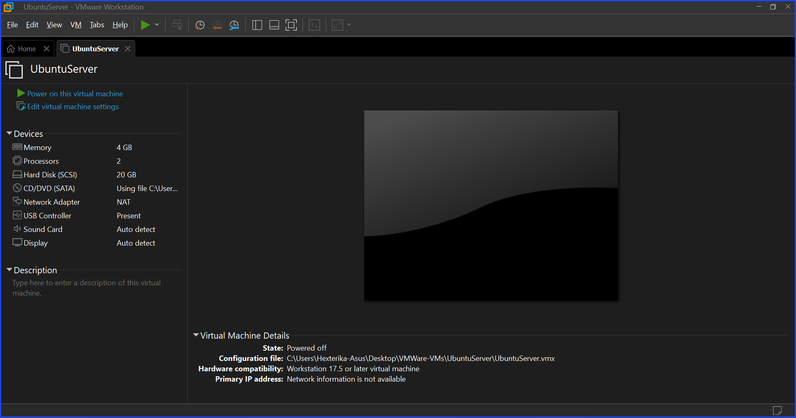
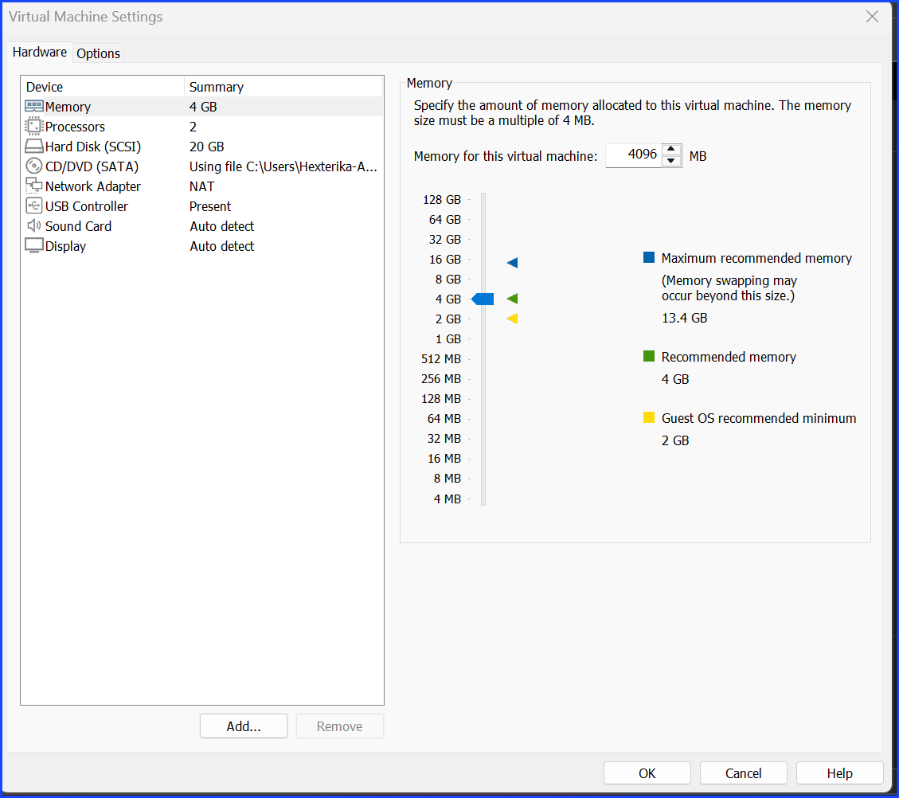
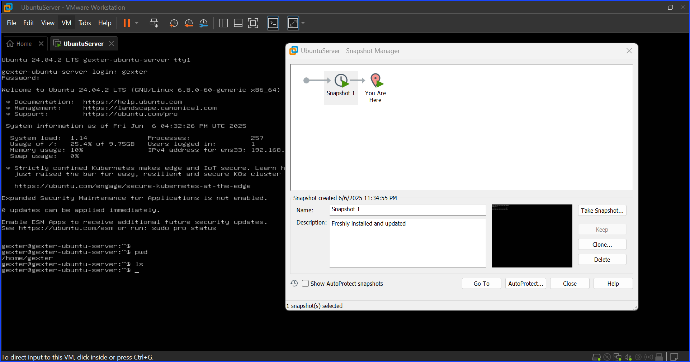

# Week 1: User Access & File Permissions

## 🖥️ Setting Up a Linux VM

I started off by setting up a new virtual machine using **VMware** with the **Ubuntu Server ISO** (`ubuntu-22.04.4-live-server-amd64.iso`). I chose a VM over WSL because **WSL lacks full Linux behavior**, especially around `systemd`, permissions, and service management.

> 🔐 Even with admin privileges, WSL is sandboxed under Windows and can't replicate real Linux environments. Trust me — you don’t want to fight with those limitations while trying to simulate real system administration tasks.

### ✅ VM Setup Steps

1. Download the Ubuntu Server ISO from [ubuntu.com](https://ubuntu.com/download/server)
2. Create a new VM in VMware:
   + 2 CPUs, 4GB RAM, 20GB disk
   + Network: NAT
3. Mount ISO and install Ubuntu Server
   + Set hostname: `gexter-ubuntu-server`
   + Create user: `gexter`
   + Install **OpenSSH** during setup
4. Complete installation and reboot into the new system

The screenshot below show the completed installation.

### 🔄 First Boot Tasks

Before doing anything else

+ Run `sudo apt update && sudo apt upgrade -y` to get the latest packages
+ Install missing tools (optional): `htop`, `net-tools`, `vim`, etc.

### 📸 Take a Snapshot

After setup and update, I took a **VM snapshot** and labeled it:
`Snapshot 1 - Freshly installed and updated`

This makes it easy to roll back if something breaks during experiments.

---

## 🚀 Jump Into the Lab

Now that the server is up, it's time to dive into Week 1 tasks: user management, permissions, and access control.

---

**Author**: Sangsongthong C.  
**Published**: [insert date here]
